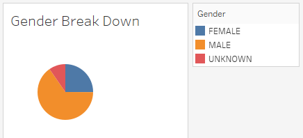
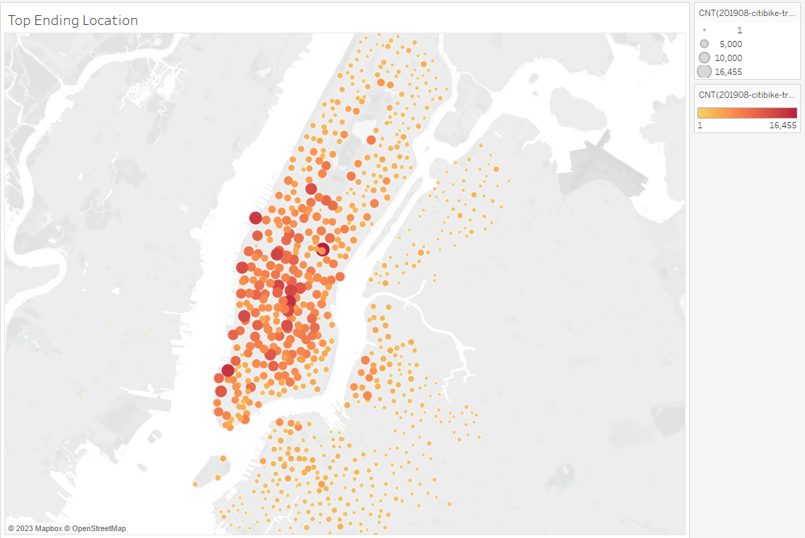
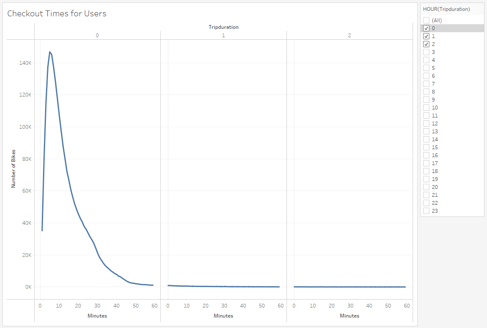
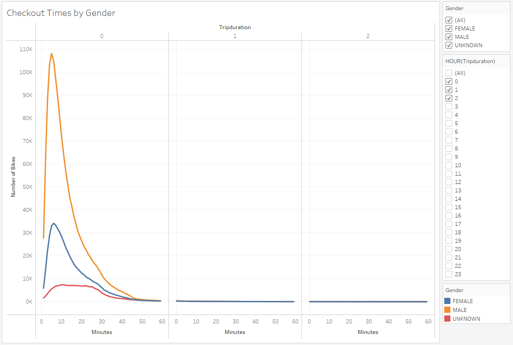
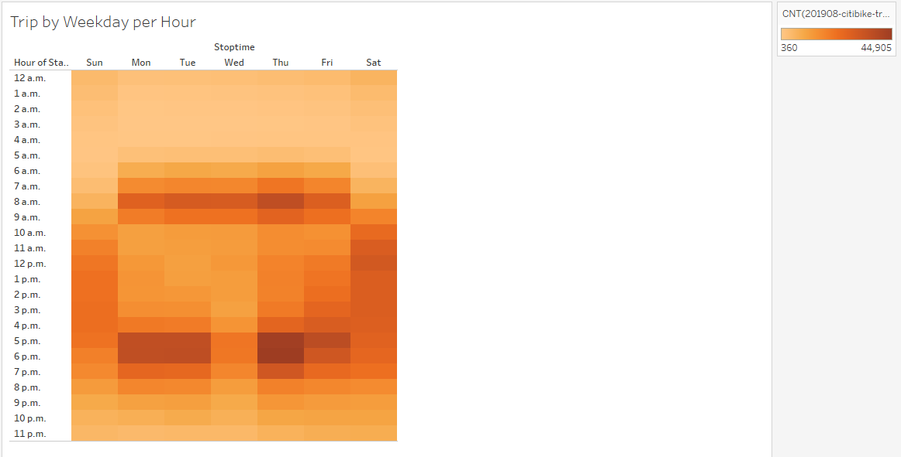
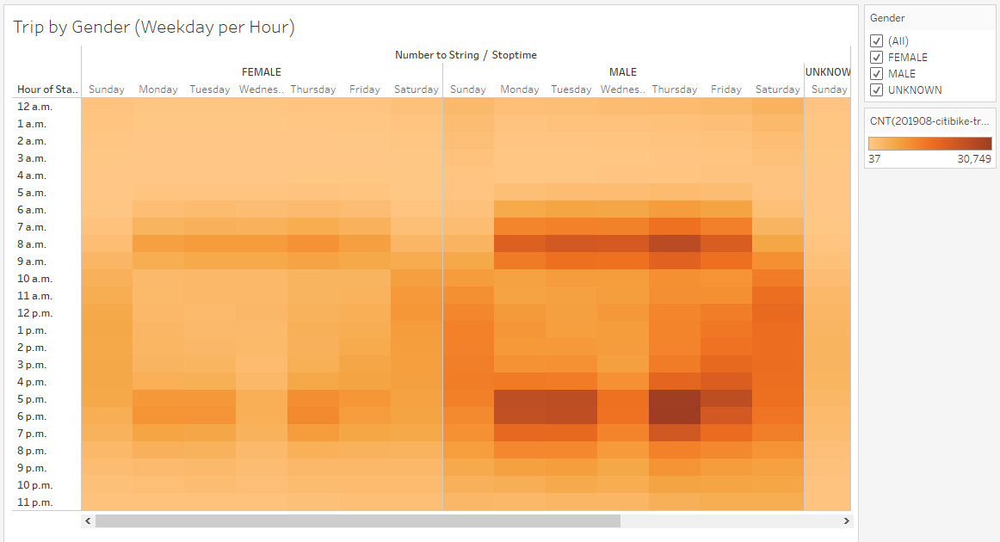
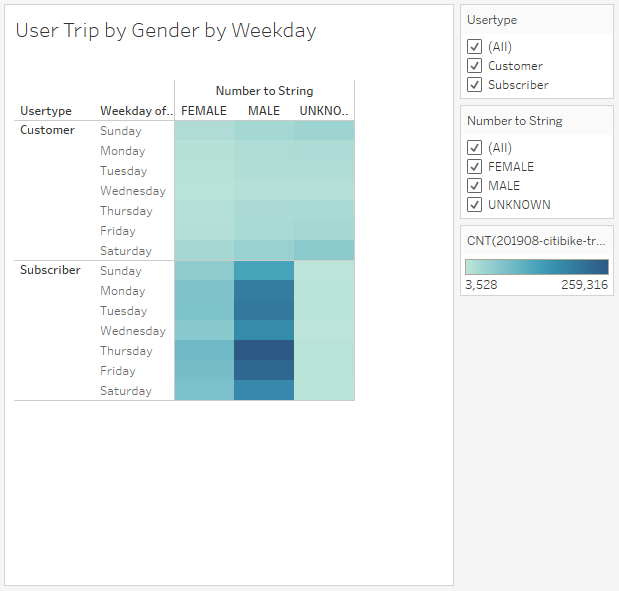

# Bike Sharing App Data Analysis

## Overview
The purpose of this analysis is to get a detailed analysis on the customers who use the bike sharing app. It is important for us to undrestand who are the daily users of the bikes, their destination, weekday distribution of usage and more. This analysis is done in Tableau and you can find the [link to dashboard here](https://public.tableau.com/app/profile/roza7019/viz/challenge1_16795182396430/NYCBikeShareing?publish=yes "link to dashboard").

The data used in this analys is from August 2019 and the data can be found here [link to data](https://citibikenyc.com/system-data "link to data")

## Results
To start the study, first lets start to see who are the main users for this program.

It can be seen that more advertisment can be done for female users to encourage them to use this program more. Next lets take a look at the end location of the bikes.

This graph shows that Manhatan area is the destination for most of the bikes. This area has high traffic and this is showing in the usage of the bikes. Now lets take a look at the time that bikes are used.

This graph shows that most users are using the bikes less than an hour. Lets get more details and investigates who are using the bikes more, male or female users.

The above graph shows that male users are female users are both using the bikes in a simillar way.Next, lets take a look at the rush hour time and see if we can find a relation between bike use and time of the day during weekdays.

As it can be seen, out assumption on the local users who use the bike to beat the traffic is correct. Now, lets do a smilar study and this time seprate male and female users.

this graph clearly shows that more advetisment is needed for female costumers to start using the bike for daily commute. Lastly lets study

## Summary

In conclusion, bikeshare service is popular in New york city. This popularity is mostly in the Manhatan area, this area has high tourist attarction and at the same time high traffic. Therfore, its users are both tourists and locals. Using rental bikes to arrive to their destination is a great way to beat traffic for locals and this can be seen in the heatmap for weekdays.

Additional analysis and visualization that can be explored are:

  - Average trip duration, by birth year can be used to underestand which age group could be targeted for advertisments.
  - Trip starting and ending locations can help find where the bikes should be distributed and help the company to move the bikes to where riders start their trip.

