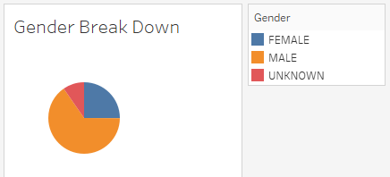
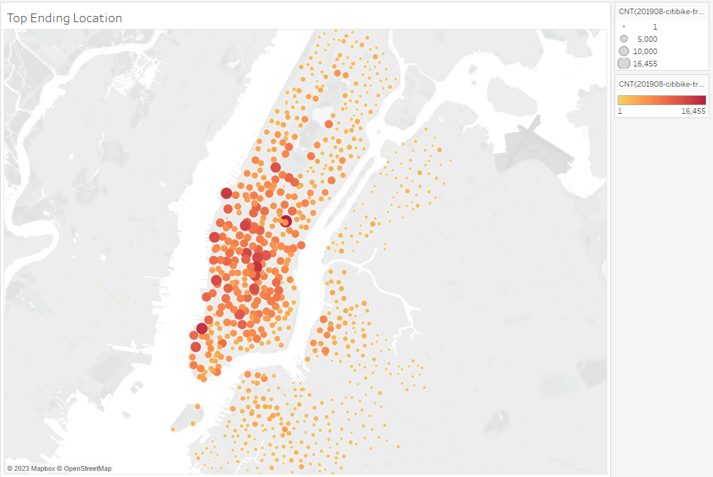

# Bike Sharing App Data Analysis

## Overview
The purpose of the analysis is well defined. (5 pt)

[link to dashboard](https://public.tableau.com/app/profile/roza7019/viz/challenge1_16795182396430/NYCBikeShareing?publish=yes "link to dashboard")

[link to data](https://citibikenyc.com/system-data "link to data")

## Results

There are at least seven visualizations for the NYC Citibike analysis (7 pt)
There is a description of the results for each visualization (7 pt)

## Summary

There is a high-level summary of the results and two additional visualizations are suggested for future analysis (5 pt)

